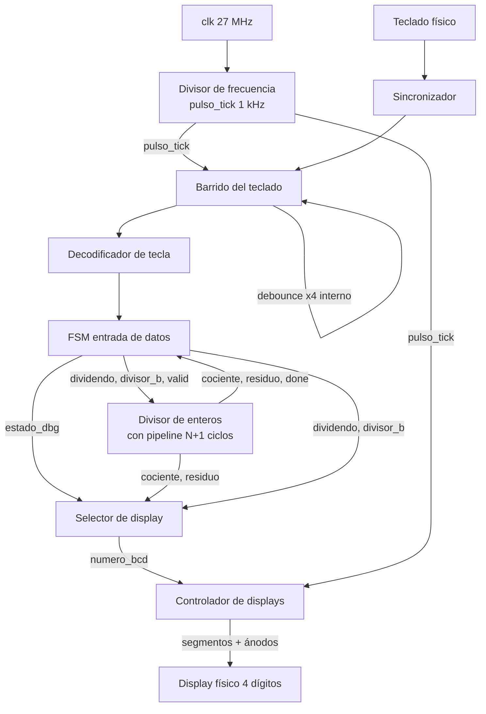

# Diagrama General del Sistema

## Diagrama de bloques completo

```mermaid
flowchart TD

CLK[clk 27 MHz] --> DF[Divisor de frecuencia\npulso_tick 1 kHz]

A[Teclado físico] --> C[Sincronizador]
DF -->|pulso_tick| E[Barrido del teclado]
C --> E
E -->|debounce x4 interno| E
E --> F[Decodificador de tecla]
F --> G[FSM entrada de datos]

G -->|dividendo, divisor_b, valid| I[Divisor de enteros\ncon pipeline N+1 ciclos]
I -->|cociente, residuo, done| G

G -->|estado_dbg| K[Selector de display]
I -->|cociente, residuo| K
G -->|dividendo, divisor_b| K

K -->|numero_bcd| M[Controlador de displays]
DF -->|pulso_tick| M

M -->|segmentos + ánodos| N[Display físico 4 dígitos]
```
