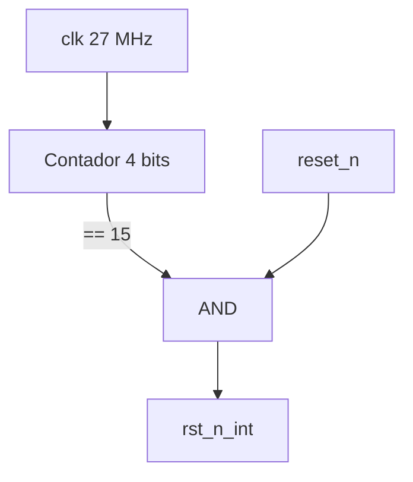

## Función
Genera la señal de reset interno (`rst_n_int`) que combina el reset externo del usuario con un delay de encendido de 15 ciclos de reloj, garantizando que el sistema arranque en estado conocido una vez que el reloj de 27 MHz se estabiliza.

## Puertos

| Puerto | Dirección | Bits | Descripción |
|---|---|---|---|
| `clk` | input | 1 | Reloj 27 MHz |
| `reset_n` | input | 1 | Reset externo activo en bajo (botón S1) |
| `rst_n_int` | output | 1 | Reset interno estabilizado |

## Descripción de funcionamiento

El módulo implementa un contador de 4 bits (`rst_cnt`) que se incrementa en cada flanco de subida del reloj mientras no alcance su valor máximo (15). La señal `rst_n_int` solo se activa cuando el contador llegó a su límite **y** el reset externo está desactivado:

```
rst_n_int = (&rst_cnt) & reset_n
```

Esto garantiza un período de espera de 15 ciclos (~556 ns a 27 MHz) antes de liberar el reset, dando tiempo a que los recursos internos de la FPGA se estabilicen tras el encendido.

## Diagrama de bloques



## Código fuente
Ver [generador_reset.sv](../src/design/generador_reset.sv)
