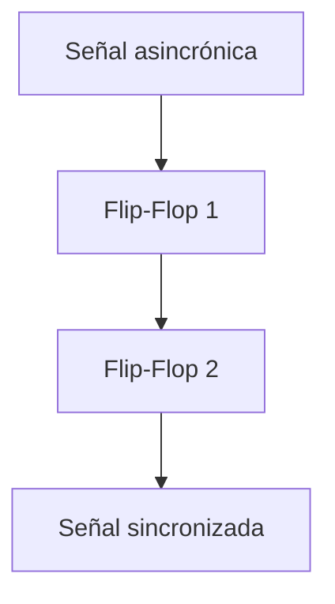

# Módulo: Sincronizador

## 1. Función del módulo

El módulo sincronizador tiene como objetivo alinear señales de entrada asincrónicas con el reloj principal del sistema, garantizando que dichas señales puedan ser procesadas de manera segura dentro de un sistema digital sincrónico.

Este módulo es fundamental para evitar problemas de metastabilidad, es decir, evita que el flip-flop no logre decidir si la salida es 0 o 1 durante un tiempo, cuando se trabajan con señales provenientes de dispositivos externos, como teclados o botones.

---

## 2. Descripción de funcionamiento

El módulo implementa un sincronizador de dos etapas utilizando flip-flops en serie. Este esquema permite reducir significativamente la probabilidad de metastabilidad en la señal de entrada.

El funcionamiento es el siguiente:

1. La señal asincrónica de entrada (`senal_async`) es capturada en el primer flip-flop (`ff1`) en el flanco de subida del reloj.
2. Debido a que esta señal no está sincronizada con el reloj, puede presentar inestabilidad en esta primera etapa.
3. En el siguiente ciclo de reloj, el valor almacenado en `ff1` es capturado por un segundo flip-flop, generando la señal de salida (`senal_sync`).
4. Esta segunda etapa permite que cualquier posible inestabilidad se disipe, entregando una señal estable y sincronizada al sistema.

De esta forma, la salida del módulo puede ser utilizada de forma segura por los demás subsistemas sin riesgo de comportamiento errático.

---

## 3. Diagrama de bloques

## 4. Frecuencia de operación

El sincronizador opera directamente con el reloj principal del sistema (27 MHz), ya que su función es alinear las señales externas a dicho dominio de reloj.

Cada etapa del sincronizador introduce un retardo de un ciclo de reloj, por lo que la señal de salida presenta un retardo total de dos ciclos respecto a la entrada.
