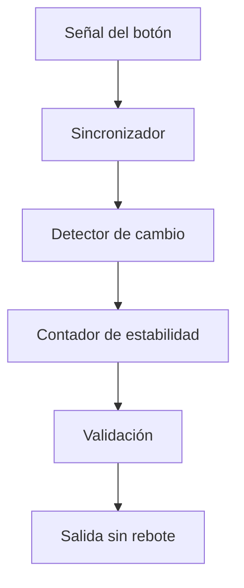

# Módulo: Debounce

## 1. Función del módulo

El módulo de debounce tiene como objetivo eliminar los efectos de rebote mecánico presentes en los botones o teclas físicas, garantizando que cada pulsación sea interpretada como un único evento válido dentro del sistema digital.

Este módulo es fundamental para evitar múltiples lecturas erróneas provocadas por transiciones rápidas no deseadas en la señal de entrada.

---

## 2. Descripción de funcionamiento

Los dispositivos mecánicos como teclados generan múltiples transiciones rápidas (rebotes) cuando se presiona una tecla. El módulo debounce filtra estas transiciones mediante un proceso de estabilización temporal.

El funcionamiento típico es el siguiente:

1. La señal de entrada se sincroniza con el reloj del sistema.
2. Se inicia un contador cuando se detecta un cambio en la señal.
3. Si la señal se mantiene estable durante un tiempo determinado (ventana de validación), el cambio se acepta como válido.
4. Si la señal cambia antes de que el contador termine, el proceso se reinicia.
5. Una vez validada, la salida se actualiza.

Este mecanismo asegura que solo cambios estables en la señal sean considerados como entradas válidas.

---

## 3. Diagrama de bloques



## 4. Simulaciones

### Resultados obtenidos (TestBench)

```
--- Prueba 1: tecla presionada con rebote ---
senal_out antes: 1
t=38ms | senal_in=0 | senal_out=0  ← acepta después de 20ms estables
senal_out despues de estabilizar: 0

--- Prueba 2: tecla soltada con rebote ---
t=89ms | senal_in=1 | senal_out=1  ← acepta liberación después de 20ms
senal_out al soltar: 1
```

## 5. Consideraciones de diseño
- Es fundamental sincronizar la señal de entrada para evitar metastabilidad.
- El tiempo de debounce debe ajustarse según el dispositivo físico utilizado.
- Un tiempo muy corto puede no eliminar correctamente los rebotes.
- Un tiempo muy largo puede hacer el sistema poco responsivo.
- El módulo debe ser completamente sincrónico.
