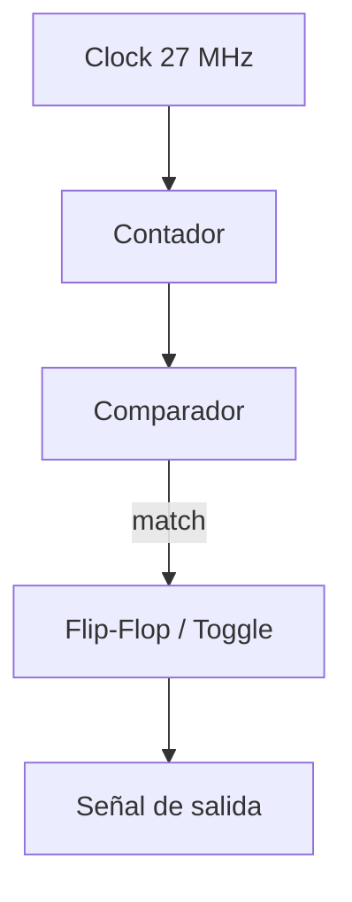

# Módulo: Divisor de Frecuencia

## 1. Función del módulo

El módulo divisor de frecuencia tiene como objetivo generar señales de menor frecuencia a partir del reloj principal del sistema (27 MHz), permitiendo el correcto funcionamiento de subsistemas que operan a velocidades más bajas, como el refresco del display de 7 segmentos y la lectura del teclado.

Este módulo es fundamental en sistemas digitales sincrónicos donde distintos bloques requieren diferentes escalas de tiempo.

---

## 2. Descripción de funcionamiento

El divisor de frecuencia se implementa mediante un contador sincrónico que incrementa su valor en cada flanco de subida del reloj principal.

Cuando el contador alcanza un valor predefinido, se genera una señal de salida (toggle o pulso), reduciendo efectivamente la frecuencia de la señal original.

Matemáticamente, la frecuencia de salida se define como:

f_out = f_clk / N

donde:
- f_clk es la frecuencia del reloj de entrada (27 MHz)
- N es el factor de división determinado por el tamaño del contador

En particular:

- Una señal de aproximadamente 1 kHz para el refresco de los displays de 7 segmentos, evitando parpadeo visible.
- Una señal de aproximadamente 100 Hz para el barrido del teclado, permitiendo una lectura estable de las teclas.

---

## 3. Diagrama de bloques

