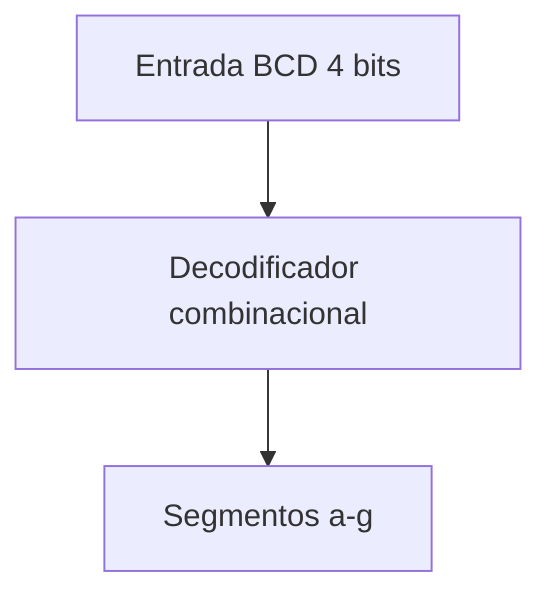

# Módulo: Decodificador de 7 Segmentos

## 1. Función del módulo

El módulo decodificador de 7 segmentos tiene como objetivo convertir un valor en formato BCD (Binary Coded Decimal) de 4 bits en las señales necesarias para controlar los segmentos de un display de 7 segmentos.

Este módulo permite representar visualmente los dígitos decimales del 0 al 9 en el display.

---

## 2. Descripción de funcionamiento

El módulo recibe un valor de 4 bits (`bcd`) correspondiente a un dígito decimal y genera una salida de 7 bits (`segmentos`), donde cada bit controla uno de los segmentos del display (a–g).

La implementación se realiza mediante lógica combinacional utilizando una estructura `case`, donde:

- Cada valor de entrada (0–9) tiene una configuración específica de segmentos.
- Los bits de salida representan el encendido o apagado de cada segmento.
- Para valores fuera del rango decimal (10–15), todos los segmentos se apagan.

El orden de los bits de salida es:

{g, f, e, d, c, b, a}

---

## 3. Diagrama de bloques

## 4. Consideraciones de diseño
- El módulo es completamente combinacional (always_comb).
- No utiliza reloj, por lo que su salida depende únicamente de la entrada.
- Está diseñado específicamente para valores decimales (0–9).
- Se asume una configuración donde un bit en alto enciende el segmento correspondiente.
- La lógica puede optimizarse mediante mapas de Karnaugh si se requiere implementación a nivel de compuertas.
