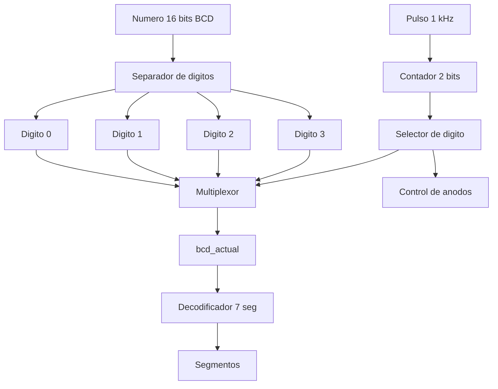

# Módulo: Controlador de Displays

## 1. Función del módulo

El módulo controlador de displays tiene como objetivo gestionar el despliegue de un número de 4 dígitos en dispositivos de 7 segmentos mediante multiplexado temporal.

Este módulo recibe un número de 16 bits en formato BCD (4 dígitos de 4 bits cada uno) y controla tanto las señales de segmentos como la activación de los ánodos, permitiendo visualizar múltiples dígitos utilizando un número reducido de líneas de control.

---

## 2. Descripción de funcionamiento

El módulo implementa un esquema de multiplexado en el cual solo un display se activa a la vez, pero a una velocidad suficientemente alta para que el ojo humano perciba todos los dígitos encendidos simultáneamente.

El proceso de funcionamiento es el siguiente:

1. El número de entrada (`numero`) se divide en cuatro dígitos BCD de 4 bits cada uno.
2. Un contador de 2 bits (`digito_activo`) selecciona cuál de los cuatro dígitos se mostrará.
3. Este contador se incrementa únicamente cuando se recibe un pulso (`pulso`) proveniente del módulo divisor de frecuencia.
4. El valor del dígito seleccionado (`bcd_actual`) se envía al decodificador de 7 segmentos.
5. Simultáneamente, se activa el ánodo correspondiente al dígito seleccionado (activo en bajo).
6. El proceso se repite cíclicamente para los cuatro dígitos.

---

## 3. Diagrama de bloques

## 4. Frecuencia de operación

El módulo utiliza una señal pulso de aproximadamente 1 kHz generada por el divisor de frecuencia.

Dado que existen 4 dígitos:

- Cada dígito se actualiza a ≈ 250 Hz
- Frecuencia total de refresco ≈ 1 kHz

Esto garantiza que:

- No exista parpadeo visible
- El sistema sea perceptualmente continuo
