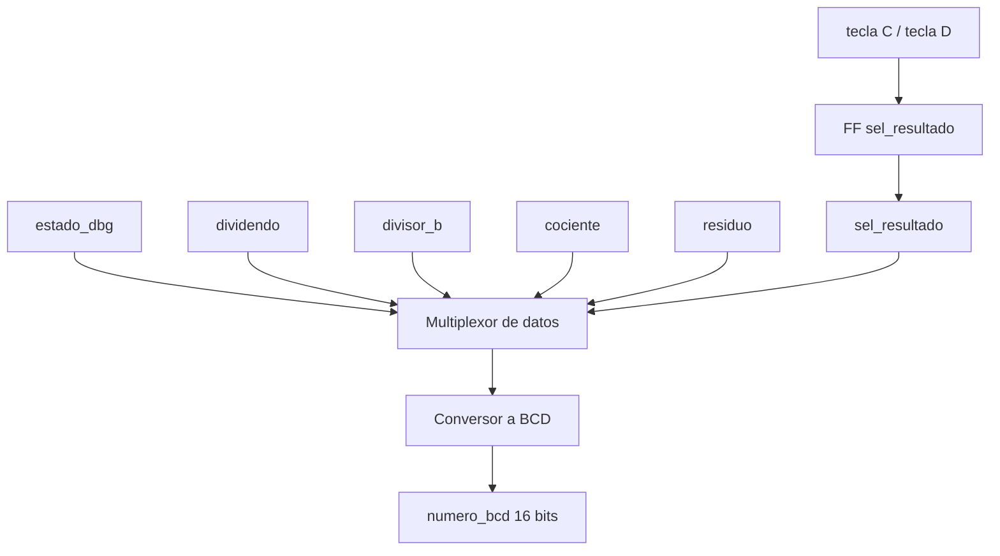

## Función
Determina qué número mostrar en el display según el estado de la FSM, gestiona el registro `sel_resultado` que alterna entre cociente y residuo con la tecla C, y convierte el valor seleccionado a formato BCD de 4 dígitos para el controlador de displays.

## Puertos

| Puerto | Dirección | Bits | Descripción |
|---|---|---|---|
| `clk` | input | 1 | Reloj 27 MHz |
| `rst_n` | input | 1 | Reset activo en bajo |
| `tecla_valida` | input | 1 | Pulso de tecla detectada |
| `seleccionar` | input | 1 | Tecla C: alternar cociente/residuo |
| `limpiar` | input | 1 | Tecla D: resetear selección |
| `estado_dbg[1:0]` | input | 2 | Estado actual de la FSM |
| `dividendo[6:0]` | input | 7 | Dividendo almacenado |
| `divisor_b[4:0]` | input | 5 | Divisor almacenado |
| `cociente[6:0]` | input | 7 | Resultado: cociente |
| `residuo[4:0]` | input | 5 | Resultado: residuo |
| `numero_bcd[15:0]` | output | 16 | 4 dígitos BCD para el display |

## Diagrama de bloques

## Selección del número a mostrar

| estado_dbg | Estado FSM | Valor mostrado |
|---|---|---|
| 0 | INGRESO_A | dividendo actual |
| 1 | INGRESO_B | divisor actual |
| 2 | CALCULANDO | dividendo (congelado) |
| 3 | RESULTADO | cociente (sel=0) o residuo (sel=1) |

## Código fuente
Ver [selector_display.sv](../src/design/selector_display.sv)
